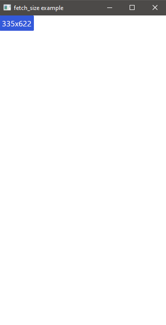

# fetch_size Example

<div align="center">
    
    
</div>

## What this does
This example shows how to get the size of the window.

When you click the button the button text changes to the window size.


## How does it work
When the button is pressed, the Message `GetScreenSize` gets produced.

This message will cause the following code, in `update`, to execute:
```rust
return iced::window::fetch_size(|size| {
    Message::ScreenSize(size.width, size.height)
});
```

Here we call the `iced::window::fetch_size` function with a closure.

```rust
|size| { Message::ScreenSize(size.width, size.height) }
```

This closure takes a `Size` as parameter and produces a `ScreenSize` Message with the width and height.

Then the with and height gets formatted in the text of the button.

```rust
Message::ScreenSize(width, height) => {
    self.button_text = format!("{}x{}", width, height);
}
```
